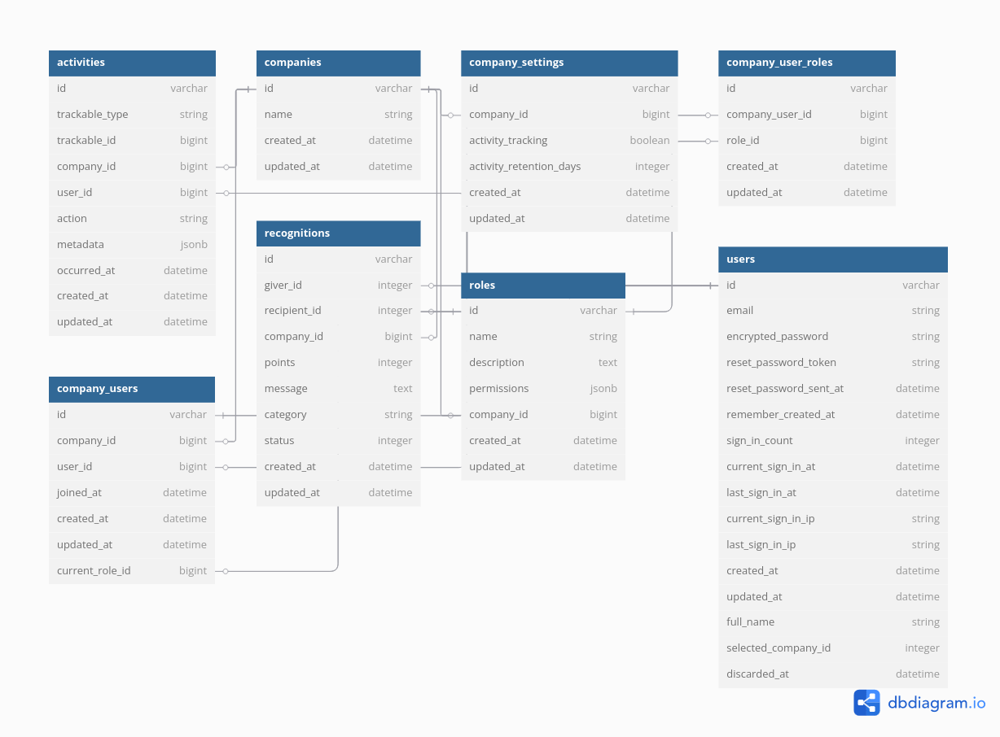

# User Activity Tracking Application
## Complete Setup and User Guide

---

## Table of Contents

1. [Application Overview](#application-overview)
2. [Technology Stack](#technology-stack)
3. [Database Setup](#database-setup)
4. [Seeding Data](#seeding-data)
5. [User Roles and Permissions](#user-roles-and-permissions)
6. [Key Features](#key-features)
7. [Database Schema](#database-schema)
8. [API Integration](#api-integration)
9. [Troubleshooting](#troubleshooting)

---

## Application Overview

The User Activity Tracking Application is a comprehensive multi-tenant Ruby on Rails application designed to track user activities, manage company teams, and provide recognition systems with detailed analytics.

### Key Benefits
- Real-time activity monitoring and tracking
- Multi-tenant architecture with complete data isolation
- Comprehensive role-based access control
- Employee recognition and appreciation system
- Advanced analytics and reporting capabilities
- Secure authentication and authorization
- Modern responsive user interface
- RESTful API for integrations

---

## Technology Stack

### Backend Technologies
| Technology | Description |
|------------|-------------|
| Ruby 3.3+ | Modern Ruby version |
| Rails 8.0.2 | Latest Rails framework |
| PostgreSQL | Primary database |
| Puma | Web server |
| Devise | Authentication system |
| Pundit | Authorization framework |
| ActsAsTenant | Multi-tenancy support |

### Frontend Technologies
| Technology | Description |
|------------|-------------|
| Turbo Rails | SPA-like experience |
| Stimulus | Modest JavaScript framework |
| TailwindCSS 4.1 | Modern CSS framework |
| Chart.js | Interactive charts |
| Chartkick | Ruby chart integration |
| ESBuild | JavaScript bundling |

---

## Database Setup

### Prerequisites
- Ruby 3.3 or higher installed
- Node.js 18+ installed (check .node-version file)
- PostgreSQL 12+ installed and running
- Git installed for version control

### Installation Steps

#### Step 1: Clone the Repository
```bash
git clone https://github.com/sparshalc/activity_trackable
cd user_activity_tracking
```

#### Step 2: Install Dependencies
```bash
# Install Ruby gems
bundle install

# Install Node.js dependencies
yarn install
```

#### Step 3: Database Configuration
Configure your database connection in `config/database.yml` file:

```yaml
development:
  adapter: postgresql
  encoding: unicode
  database: user_activity_tracking_development
  pool: <%= ENV.fetch("RAILS_MAX_THREADS") { 5 } %>
  username: your_postgres_username
  password: your_postgres_password
  host: localhost
```

#### Step 4: Create and Setup Database
```bash
# Create database
rails db:create

# Run migrations
rails db:migrate
```

#### Step 5: Asset Compilation
```bash
# Build CSS and JavaScript
yarn build
yarn build:css
```

---

## Seeding Data

The application includes a comprehensive seed file that creates sample data for testing and development purposes.

### Running the Seed Process
```bash
rails db:seed
```

### What Gets Created by Seeds

#### Sample Companies
- Acme Corporation
- TechStart Inc
- Global Solutions Ltd

#### Sample Users
| Email | Password | Full Name | Role(s) |
|-------|----------|-----------|---------|
| admin1@example.com | password123 | Admin One | Admin at Acme Corp, Employee at TechStart |
| admin2@example.com | password123 | Admin Two | Admin at TechStart, Manager at Global Solutions |
| admin3@example.com | password123 | Admin Three | Admin at Global Solutions, Employee at Acme Corp |
| john.doe@acme.com | password123 | John | Employee at Acme Corporation |
| jane.smith@acme.com | password123 | Jane | Employee at Acme Corporation |
| bob.wilson@techstart.com | password123 | Bob | Employee at TechStart Inc |
| alice.brown@techstart.com | password123 | Alice | Employee at TechStart Inc |
| mike.jones@global.com | password123 | Mike | Employee at Global Solutions Ltd |

### Important Seeding Notes
- The seed process will clean existing data in development environment
- All sample users have the password "password123"
- Multi-company users (admins) can switch between companies
- Each company gets its own set of roles with proper permissions
- Company settings are automatically created for each company

---

## User Roles and Permissions

The application implements a sophisticated role-based access control system with four distinct user roles, each with specific permissions.

### Role Hierarchy
| Role | Description |
|------|-------------|
| Owner | Company owner with complete administrative access and full control over all features |
| Admin | Administrator with comprehensive management access, nearly identical to owner permissions |
| Manager | Team manager with limited administrative access, can view analytics and manage recognitions |
| Employee | Regular employee with basic access to dashboard, activities, and profile management |

### Detailed Permissions Matrix
| Feature | Owner | Admin | Manager | Employee |
|---------|-------|-------|---------|----------|
| Dashboard Access | ✅ | ✅ | ✅ | ✅ |
| Analytics View | ✅ | ✅ | ✅ | ❌ |
| User Management - View | ✅ | ✅ | ✅ | ❌ |
| User Management - Create | ✅ | ✅ | ❌ | ❌ |
| User Management - Update | ✅ | ✅ | ❌ | ❌ |
| User Management - Delete | ✅ | ✅ | ❌ | ❌ |
| Activities - View | ✅ | ✅ | ✅ | ✅ (Own Only) |
| Activities - Export | ✅ | ✅ | ❌ | ❌ |
| Recognitions - View | ✅ | ✅ | ✅ | ✅ |
| Recognitions - Create | ✅ | ✅ | ✅ | ❌ |
| Company Settings - View | ✅ | ✅ | ❌ | ❌ |
| Company Settings - Edit | ✅ | ✅ | ❌ | ❌ |
| User Profile - View | ✅ | ✅ | ✅ | ✅ |
| User Profile - Edit | ✅ | ✅ | ✅ | ✅ |
| Company Switcher | ✅ | ✅ | ✅ | ✅ |

### Available Resources and Actions
| Resource | Available Actions |
|----------|-------------------|
| dashboard | view |
| analytics | view |
| users | view, create, update, delete |
| activities | view, export |
| recognitions | view, create |
| company_settings | view, edit |
| user_profile | view, edit |
| company_switcher | view |

---

## Key Features

### 🔍 Activity Tracking
- **Comprehensive Activity Logging**: Automatically tracks user logins, logouts, profile updates, and system interactions
- **Multi-tenant Architecture**: Full isolation between companies with secure data segregation
- **Rich Metadata**: Captures IP addresses, user agents, session duration, and custom metadata
- **Configurable Retention**: Customizable data retention periods per company
- **Real-time Monitoring**: Live activity feeds and instant notifications

### 👥 User Management
- **Role-based Access Control**: Owner, Admin, Manager, and Employee roles with granular permissions
- **Soft Delete System**: Safe user deactivation with full audit trails
- **Multi-company Support**: Users can belong to multiple organizations
- **Authentication**: Secure user authentication with Devise
- **Profile Management**: Comprehensive user profile system

### 🏢 Company Management
- **Multi-tenant Architecture**: Complete company isolation using acts_as_tenant
- **Company Settings**: Configurable activity tracking and retention policies
- **Team Management**: Add/remove users, assign roles, manage permissions
- **Company Switching**: Seamless switching between multiple companies
- **Default Setup**: Automatic role and settings creation for new companies

### 🏆 Recognition System
- **Peer Recognition**: Employee recognition and appreciation system
- **Activity Integration**: Recognition events are automatically tracked
- **Recognition History**: Complete history of given and received recognitions

### 📊 Analytics & Reporting
- **Interactive Charts**: Powered by Chart.js and Chartkick
- **Activity Analytics**: Detailed insights into user engagement patterns
- **Date Range Filtering**: Flexible time-based analysis
- **User Activity Summaries**: Individual and company-wide activity reports
- **Export Capabilities**: CSV export functionality for reports

### 🔐 Security & Permissions
- **Pundit Authorization**: Fine-grained authorization policies
- **Role-based Permissions**: Hierarchical permission system
- **Data Sanitization**: Automatic removal of sensitive data from activity logs
- **Request Tracking**: Secure request correlation and tracking

---

## Database Schema

### Entity Relationship Diagram (ERD)



The above ERD shows the complete database structure and relationships between all entities in the User Activity Tracking application.

### Core Tables

#### Activities Table
Tracks all user activities with rich metadata:
```sql
- trackable_type & trackable_id (polymorphic)
- company_id (multi-tenant isolation)
- user_id (activity owner)
- action (type of activity)
- metadata (JSONB for flexible data)
- occurred_at (timestamp)
```

#### Companies Table
Core tenant entities:
```sql
- name (company name)
- created_at, updated_at
```

#### Users Table
User accounts with Devise authentication:
```sql
- email (unique identifier)
- encrypted_password (Devise)
- full_name (display name)
- selected_company_id (current company)
- discarded_at (soft delete)
- sign_in tracking fields
```

#### Roles Table
Company-specific role definitions:
```sql
- name (role identifier)
- description (role description)
- permissions (JSONB structure)
- company_id (tenant isolation)
```

#### Company Users Table
Links users to companies:
```sql
- company_id, user_id (association)
- current_role_id (active role)
- joined_at (membership date)
```

#### Recognitions Table
Employee recognition system:
```sql
- giver_id, recipient_id (user references)
- company_id (tenant isolation)
- points, message, category
- status (enum: pending, approved, etc.)
```

### Key Relationships

- **Multi-tenancy**: All core entities are scoped to companies for complete data isolation
- **User-Company Association**: Users can belong to multiple companies through the company_users join table
- **Role-based Access**: Roles are company-specific with JSONB permissions for flexible authorization
- **Activity Tracking**: Polymorphic activities table tracks all user actions across different models
- **Recognition System**: Peer-to-peer recognition with points and categories for employee appreciation

---

## API Integration

The application provides RESTful API endpoints for integration with external systems.

### Available API Endpoints
| Method | Endpoint | Description |
|--------|----------|-------------|
| GET | /api/activities | Retrieve user activities |
| POST | /api/activities | Create new activity record |
| GET | /api/users | Retrieve users list |
| POST | /api/users | Create new user |
| GET | /api/recognitions | Retrieve recognitions |
| POST | /api/recognitions | Create new recognition |

### API Authentication
API endpoints require proper authentication using session-based authentication or API tokens.

---

## Application Screenshots Guide

To capture screenshots of your running application:

### Starting the Application
```bash
# Start all services (Rails + asset watchers)
bin/dev

# Or start Rails server only
rails server
```

### Access Points
- **URL**: http://localhost:3000
- **Admin Login**: admin1@example.com / password123
- **Employee Login**: john.doe@acme.com / password123

### Suggested Pages to Screenshot
1. **Login/Registration Page** - `/users/sign_in`
2. **Dashboard with Activity Charts** - `/`
3. **User Management Interface** - `/users`
4. **Activity Tracking Log** - `/activities`
5. **Recognition System** - `/recognitions`
6. **Analytics Dashboard** - `/analytics`
7. **Company Settings Page** - `/company_settings/edit`
8. **User Profile Management** - `/users/edit`
9. **Company Switcher Interface** - Multi-company dropdown

---

## Troubleshooting

### Common Issues and Solutions
| Issue | Solution |
|-------|----------|
| Assets not loading | Run `yarn build && yarn build:css` to rebuild assets |
| Database connection errors | Check PostgreSQL service status and database.yml configuration |
| Permission denied errors | Verify user roles and Pundit policies are correctly configured |
| Activity tracking not working | Check company settings and ensure activity tracking is enabled |
| Seeding fails | Ensure database is created and migrated before running seeds |
| Login issues | Verify user credentials and check if account is active |
| Multi-tenancy problems | Ensure ActsAsTenant.current_tenant is properly set |
| Chart not displaying | Check if Chartkick and Chart.js assets are properly loaded |

### Log Files Location
- **Development logs**: `log/development.log`
- **Production logs**: `log/production.log`
- **Test logs**: `log/test.log`

### Getting Help
- Create an issue in the repository for bug reports
- Check the README.md file for additional documentation
- Review code comments and test files for implementation details
- Consult the Rails and gem documentation for specific technologies

---

## Quick Start Checklist

- [ ] Clone repository
- [ ] Install dependencies (`bundle install`, `yarn install`)
- [ ] Configure database.yml
- [ ] Create database (`rails db:create`)
- [ ] Run migrations (`rails db:migrate`)
- [ ] Seed sample data (`rails db:seed`)
- [ ] Build assets (`yarn build && yarn build:css`)
- [ ] Start application (`bin/dev`)
- [ ] Access at http://localhost:3000
- [ ] Login with sample accounts
- [ ] Explore features and capture screenshots

---

**Built with ❤️ using Ruby on Rails 8.0.2**

*Generated: December 2024* 